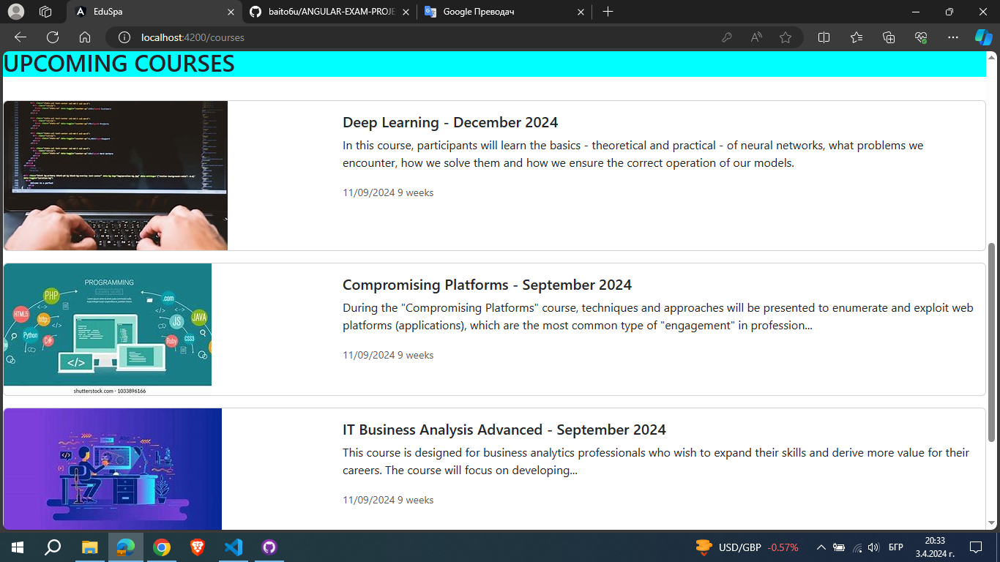
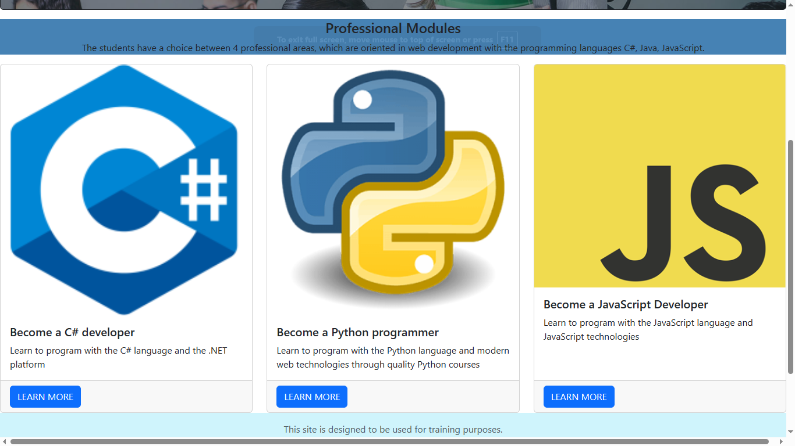
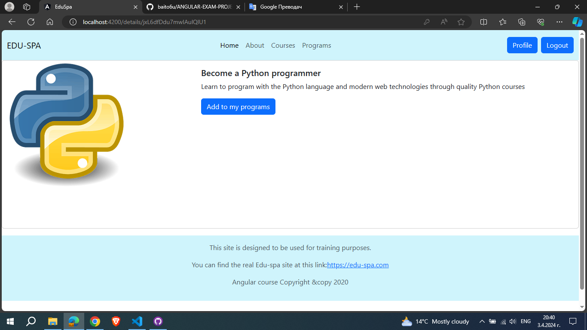
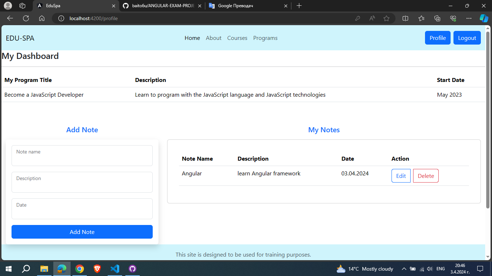

# ANGULAR-EXAM-PROJECT-2024

Edu-Api
Edu-Api is an education project built with Angular 16 using HTML, CSS, BOOTSTRAP 5, and uses Firebase as a databasse and authentication. 
This is for university or school or any educational institute. It consists of 6 pages: Home, About, Courses, Programs, Details, Profile.

You will need installed:

ANGULAR:	16.2.0: npm i @angular/cli@16.2.0

NODE.JS: 16.14.0 || ^18.10.0	 

TYPESCRIPT: 5.1.3

"firebase": 10.9.0 npm install firebase

Run application: 
npm install 
ng serve --open //Which opens the app at http://localhost:4200 in your browser. 

Home Page: when there is no user:

Home Page: when user is logged in:

Courses Page: dynamically loads data from Firestore:

Programs Page: dynamically loads data from Firestore and by clicking Learn more redirect to Details Page only for logged in users:

Details page: dynamically loads data from Firestore and by clicking Add to my programs redirect to Profile page only for logged in users:

Profile page: visible only for logged in users where can add, edit, delete some notes and stored in Firestore:

Created by Todor Krumov